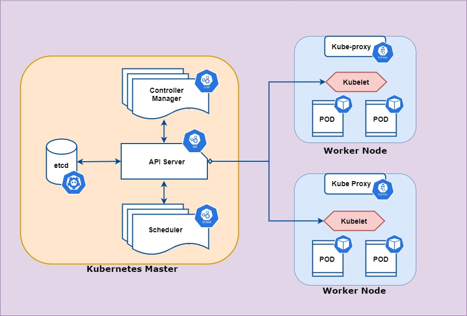

API Server and API Object
================================

参考：

- https://kubernetes.io/docs/reference/using-api/
- https://kubernetes.io/docs/concepts/overview/working-with-objects/kubernetes-objects/
- https://kubernetes.io/docs/reference/kubernetes-api/

API Server
--------------

Kubernetes的API Server是一个client/server的架构

- 通过HTTP对外提供RESTful　API服务，client提交请求，server回复
- 是无状态的stateless，所有的状态都存储在cluster　store里（etcd）
  

.. code-block:: bash

   $ kubectl cluster-info
   $ kubectl config view
   $ kubectl config view --raw
   $ kubectl config get-contexts

Clients
~~~~~~~~~~~

- kubectl
- RESTful API
- other clients

API Object
-------------

API Object是通过API server可以操作的Kubernetes对象，它们代表了整个集群的状态，比如：

- What containerized applications are running (and on which nodes)
- The resources available to those applications
- The policies around how those applications behave, such as restart policies, upgrades, and fault-tolerance

API Object通过以下字段组织起来

- Kind (Pod, Deployment, Service, etc.)
- Group (core, apps, storage), see https://kubernetes.io/docs/reference/generated/kubernetes-api/v1.24/
- Version (v1, beta, alpha) see https://kubernetes.io/docs/reference/using-api/#api-versioning

.. code-block:: bash

   $ kubectl api-resources | more
   $ kubectl api-resources --api-group=apps | more
   $ kubectl api-versions | sort | more

如何操作API Object
~~~~~~~~~~~~~~~~~~~~~~

两种模式

- Imperative Configuration (直接通过命令行去创建，操作)
- Declarative Configuration (通过YAML/JSON格式定义Manifest，把期望状态定义在文件中, 然后把文件传给API server)

.. code-block:: yaml

   apiVersion: v1
   kind: Pod
   metadata:
   name: web
   spec:
      containers:
      - name: nginx-container
         image: nginx:latest

.. code-block:: bash

   $ kubectl apply -f nginx.yml  # Declarative Configuration
   $ kubectl run web --image=nginx # Imperative Configuration 
