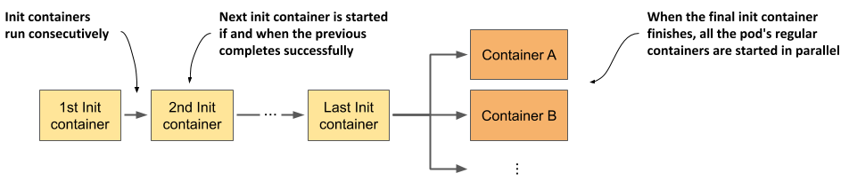

Init Containers
===================

https://kubernetes.io/docs/concepts/workloads/pods/init-containers/

why init containers
----------------------

- 初始化
- 处理依赖，控制启动

.. code-block:: yaml

  apiVersion: v1
  kind: Pod
  metadata:
    name: pod-with-init-containers
  spec:
    initContainers:
    - name: init-service
      image: busybox
      command: ["sh", "-c", "echo waiting for sercice; sleep 4"]
    - name: init-database
      image: busybox
      command: ["sh", "-c", "echo waiting for database; sleep 4"]
    containers:
    - name: app-container
      image: nginx
