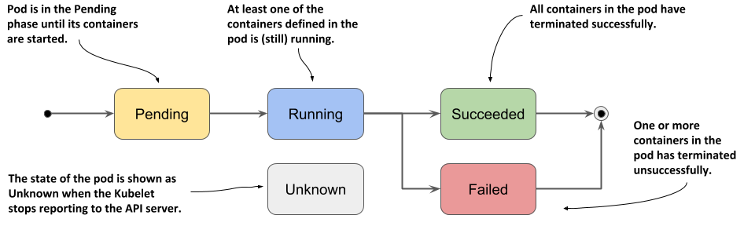

Pod Lifecycle
=================

Linux补充知识

SIGTERM vs SIGKILL: What's the Difference?

https://linuxhandbook.com/sigterm-vs-sigkill/

Pod Lifecycle
-----------------

参考 https://kubernetes.io/docs/concepts/workloads/pods/pod-lifecycle/

pod phase

Container state
----------------

- waiting
- Running
- Termination

  - Process is terminated/crashed
  - Pod is deleted
  - Node failure or maintenance
  - Evicteed due to lack of resources

Stopping/Terminating Pods
-----------------------------

.. code-block:: bash

    kubectl delete pod <name>

当执行删除的时候，

- API server会设置一个timer（grace period Timer），默认是30秒
- 同时pod状态改成Terminating
- Pod所在node上的kubelet收到命令，会给Pod里的container发送SIGTERM信号，然后等等container退出
- 如果container在timer到时之前退出了，那么pod信息同时会被API server从存储中删除
- 如果container没有在timer到时之前退出，则kubelet会发送SIGKILL信息到pod里的容器，强制杀死容器， 最后API server更新存储etcd

grace period timer是可以修改的

.. code-block:: bash

    $ kubectl delete pod <name> --grace-period=<seconds>

.. code-block:: yaml

    apiVersion: v1
    kind: Pod
    metadata:
      name: web
    spec:
      terminationGracePeriodSeconds: 10
      containers:
      - image: nginx
        name: web

或者也可以直接就强制删除pod （SIGKILL）

.. code-block:: bash

    $ kubectl delete pod <name> --grace-period=0 --force

Persistency of Pod
---------------------

Pod本身不会重新自动部署

如果一个pod停止了，它不会重启动，只有可能创建一个新的

如果有配置需要持久化怎么办？

- Pod Manifests, secrets and ConfigMaps
- environment variables

数据持久？

- PersistentVolume
- PersistentVolumeClaim

Container Restart Policy
---------------------------

The spec of a Pod has a restartPolicy field with possible values ``Always``, ``OnFailure``, and ``Never``. The default value is Always.

.. code-block:: bash

    vagrant@k8s-master:~$ kubectl run web --image nginx --dry-run=client -o yaml
    apiVersion: v1
    kind: Pod
    metadata:
      creationTimestamp: null
      labels:
        run: web
      name: web
    spec:
      containers:
      - image: nginx
        name: web
        resources: {}
      dnsPolicy: ClusterFirst
      restartPolicy: Always
    status: {}
