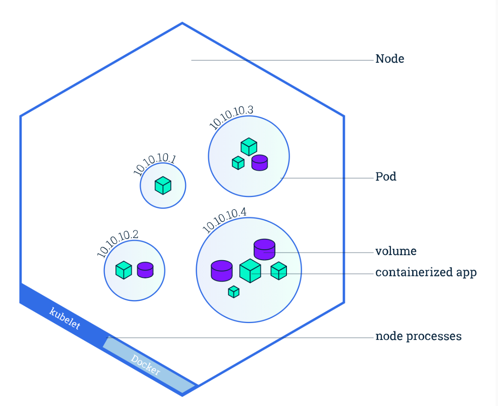

Pod
======

https://kubernetes.io/docs/concepts/workloads/pods/

What is Pod?
----------------

Pod是k8s里最小的调度单位。

- A group of one or more application containers and their shared resources like volume.
- A pod share the same name spaces like network name spaces (have same IP address.)
- Pod is the smallest unit for K8s scheduling

.. note::

   关于容器，name spaces，欢迎参考另一篇关于Docker的文档 https://dockertips.readthedocs.io/en/latest/single-host-network.html

How to create a pod?
-------------------------

Imperative
~~~~~~~~~~~~~

Create a pod named web with image of nginx:latest

.. code-block:: bash

   $ kubectl run web --image=nginx
   pod/web created

运行一个命令, kubectl run <pod name> --image=<image name> --command -- <cmd> <arg1> ... <argN>

.. code-block:: bash

   $ kubectl run client --image=busybox --command -- bin/sh -c "sleep 100000"

Declarative
~~~~~~~~~~~~~

以下yaml文件是定义一个pod所需的最少字段 (nginx.yml)

.. code-block:: yaml

   apiVersion: v1
   kind: Pod
   metadata:
     name: web
   spec:
      containers:
       - name: nginx-container
         image: nginx:latest

.. code-block:: bash

   $ kubectl apply -f nginx.yml
   pod/web created

运行一个命令, sh -c "sleep 1000000"

.. code-block:: yaml

   apiVersion: v1
   kind: Pod
   metadata:
      name: client
   spec:
      containers:
       - name: client
         image: busybox
         command:
          - sh
          - -c
          - "sleep 1000000"

multi-container pod
-----------------------------

一个pod是可以包含多个container的，如果要创建这样的pod，那么只能通过yaml文件实现，例如：

.. code-block:: yaml

   apiVersion: v1
   kind: Pod
   metadata:
      name: my-pod
   spec:
      containers:
       - name: nginx
         image: nginx
       - name: client
         image: busybox
         command:
          - sh
          - -c
          - "sleep 1000000"

.. code-block:: bash

   $ kubectl create -f my-pod.yml
   $ kubectl get pod
   NAME     READY   STATUS    RESTARTS   AGE
   my-pod   2/2     Running   0          35s

Pod YAML 语法
---------------

查文档 kubernetes.io, 命令行帮助

.. code-block:: bash

   kubectl explain pods | more
   kubectl explain pod.spec | more
   kubectl explain pod.spec.containers | more

kubectl dry-run
------------------

Server-side
~~~~~~~~~~~~~~~~

和正常情况一样处理客户端发送过来的请求，但是并不会把Object状态持久化存储到storage中

.. code-block:: bash

   $ kubectl apply -f nginx.yml --dry-run=server

Client-side
~~~~~~~~~~~~~~~~

- 把要操作的Object通过标准输出stdout输出到terminal
- 验证manifest的语法
- 可以用于生成语法正确的Yaml manifest

.. code-block:: bash

   $ kubectl apply -f nginx.yml --dry-run=client
   $ kubectl run web --image=nginx --dry-run=client -o yaml
   $ kubectl run web --image=nginx --dry-run=client -o yaml > nginx.yml

kubectl diff
----------------

显示当前要部署的manifest和集群中运行的有和不同，这样就知道如果apply会发生什么。

.. code-block:: bash

   $ kubectl diff -f new-nginx.yml

Pod的基本操作
---------------

获取pod列表
~~~~~~~~~~~~~~~~~

.. code-block:: bash

   vagrant@k8s-master:~$ kubectl get pods
   NAME     READY   STATUS    RESTARTS   AGE
   client   1/1     Running   0          5m14s
   web      1/1     Running   0          15m
   vagrant@k8s-master:~$ kubectl get pods -o wide
   NAME     READY   STATUS    RESTARTS   AGE     IP           NODE          NOMINATED NODE   READINESS GATES
   client   1/1     Running   0          5m17s   10.244.2.4   k8s-worker2   <none>           <none>
   web      1/1     Running   0          15m     10.244.1.2   k8s-worker1   <none>           <none>

通过 ``-o yaml`` 可以获取到具体一个pod的yaml定义文件

.. code-block:: bash

   $ kubectl get pods client -o yaml

删除Pod
~~~~~~~~~~~

.. code-block:: bash

   $ kubectl delete pod web
   pod "web" deleted

获取pod详细信息
~~~~~~~~~~~~~~~~~~

.. code-block:: bash

   $ kubectl describe pod my-pod

进入容器执行命令
-------------------

对于只有单个容器的Pod， 执行date命令

.. code-block:: bash

   vagrant@k8s-master:~$ kubectl get pods
   NAME     READY   STATUS    RESTARTS   AGE
   client   1/1     Running   0          38s
   my-pod   2/2     Running   0          6s
   vagrant@k8s-master:~$ kubectl exec client -- date
   Wed Jun  1 21:57:07 UTC 2022

进入交互式shell

.. code-block:: bash

   vagrant@k8s-master:~$ kubectl exec client -- date
   Wed Jun  1 21:57:07 UTC 2022
   vagrant@k8s-master:~$ kubectl exec client -it -- sh
   / #
   / # ip a
   1: lo: <LOOPBACK,UP,LOWER_UP> mtu 65536 qdisc noqueue qlen 1000
      link/loopback 00:00:00:00:00:00 brd 00:00:00:00:00:00
      inet 127.0.0.1/8 scope host lo
         valid_lft forever preferred_lft forever
      inet6 ::1/128 scope host
         valid_lft forever preferred_lft forever
   3: eth0@if7: <BROADCAST,MULTICAST,UP,LOWER_UP,M-DOWN> mtu 1450 qdisc noqueue
      link/ether a6:56:08:ba:34:28 brd ff:ff:ff:ff:ff:ff
      inet 10.244.1.3/24 brd 10.244.1.255 scope global eth0
         valid_lft forever preferred_lft forever
      inet6 fe80::a456:8ff:feba:3428/64 scope link
         valid_lft forever preferred_lft forever
   / #

对于具有多个容器的pod，需要通过 ``-c`` 指定要进入那个容器中。

.. code-block:: bash

   vagrant@k8s-master:~$ kubectl get pods
   NAME     READY   STATUS    RESTARTS   AGE
   client   1/1     Running   0          3m16s
   my-pod   2/2     Running   0          2m44s
   vagrant@k8s-master:~$ kubectl exec my-pod -c
   client  nginx
   vagrant@k8s-master:~$ kubectl exec my-pod -c nginx -- date
   Wed Jun  1 21:59:58 UTC 2022

API level log
-----------------

通过 ``-v`` 可以获取到每一个kubectl命令在API level的log，例如

获取kubectl操作更详细的log, API level（ 通过 -v 指定）

.. code-block:: bash

   $ kubectl get pod <pod-name> -v 6   # 或者 7,8,9 不同的level，数值越大，得到的信息越详细

``--watch`` 持续监听kubectl操作，API level

.. code-block:: bash

   $ kubectl get pods <pod-name> --watch -v 6

static pod
----------------

sudo cat /var/lib/kubelet/config.yaml

static pod in /etc/kubernetes/manifests/

Pod with init containers
---------------------------

.. code-block:: yaml

  apiVersion: v1
  kind: Pod
  metadata:
    name: pod-with-init-containers
  spec:
    initContainers:
    - name: init-service
      image: busybox
      command: ["sh", "-c", "echo waiting for sercice; sleep 2"]
    - name: init-database
      image: busybox
      command: ["sh", "-c", "echo waiting for database; sleep 2"]
    containers:
    - name: app-container
      image: nginx
        image: busybox

Pod Lifecycle
--------------------

Pod Health
-------------

LivenessProbes
~~~~~~~~~~~~~~~~~~

- Runs a diagnostic check on a container
- Per container setting
- On failure, the kubelet restarts the container
- Container Restart Policy
- Give Kubernetes a better understanding of our applications

readinessProbes
~~~~~~~~~~~~~~~~~~~~~~

- Runs a diagnostic check on a container
- Per container setting
- Won't receive traffic from a service until it succeeds
- On failure, remove Pod from load balancing
- Applications that temporarily can't respond to a request
- Prevents users from seeting errors

type of Diagnostic Checks for Probes

- Exec
- tcpSocket
- httpGet
