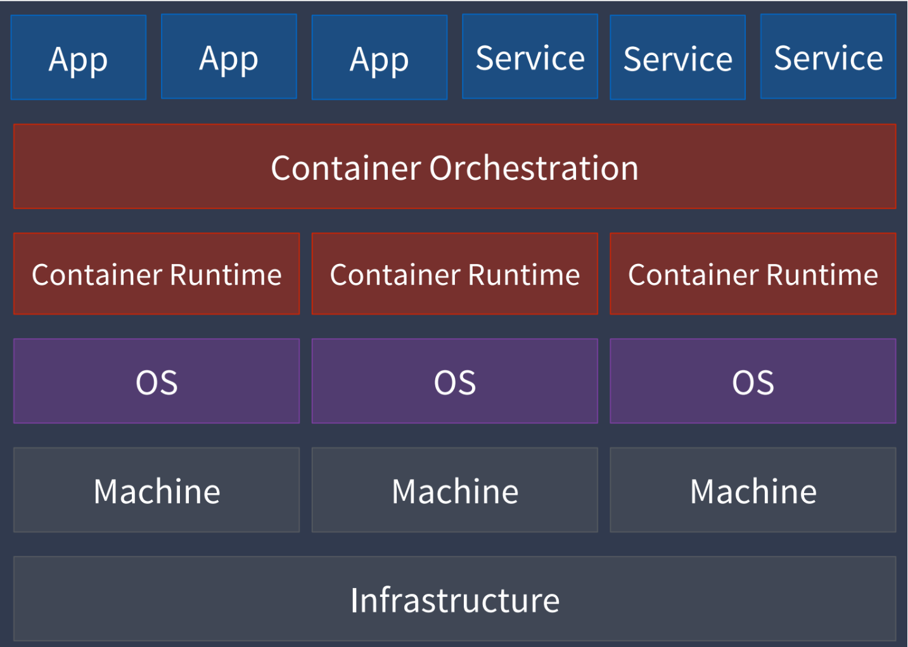

Introduction
===============

容器技术？ https://dockertips.readthedocs.io/en/latest/docker-install/docker-intro.html

Container Orchestration
--------------------------

Kubernetes is an open-source container orchestration system for automating software deployment, scaling, and management.
Google originally designed Kubernetes, but the Cloud Native Computing Foundation now maintains the project. - Wikipedia

Kubernetes Architecture
-----------------------------

.. image:: _static/introduction/kubernetes_architecture.jpg
   :alt: kubernetes_architecture

Control Plane
~~~~~~~~~~~~~~~~~~~~~

Master节点主要有4个主要组件：

- API Server 跟集群进行交互的接口（kubectl)
- etcd, 集群数据存储
- Scheduler，根据不同的因素决定最终的容器运行在哪个节点node上
- Controller Manager，管理不同的controller的

Worker Node
~~~~~~~~~~~~~~~~

Worker节点的三个主要组件：

- kubelet 运行在每一个node上的agent，负责确保最终的pod创建启动停止销毁等，直接和container runtime交互
- kubeproxy 运行在每一个node上的network agent，负责网络通信部分，pod之间，pod和外界之间等
- container runtime 具体的容器运行时，比如docker，containerd等