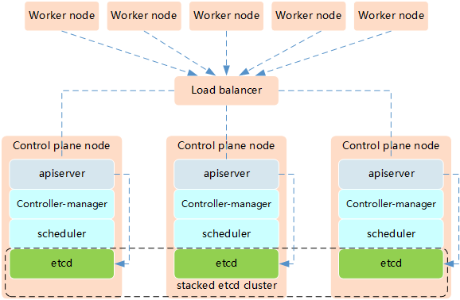
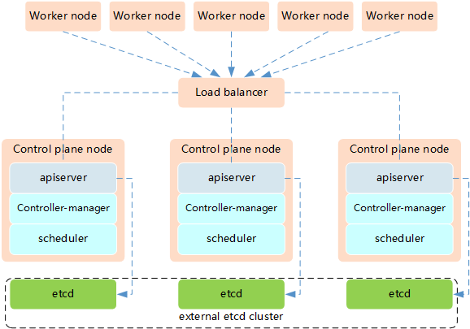

Highly Available Clusters
=============================

High Availability (HA) in Kubernetes ensures your cluster remains operational even when components fail. This involves running multiple instances of control plane components and using load balancers.

更多信息： https://kubernetes.io/docs/setup/production-environment/tools/kubeadm/high-availability/

Why High Availability?
-------------------------

**Benefits:**

- **No single point of failure**: Cluster continues operating if a control plane node fails
- **Zero downtime**: Perform maintenance without cluster downtime
- **Better performance**: Distribute load across multiple API servers
- **Production readiness**: Required for critical production workloads

**What needs to be HA:**

- **Control plane components**: API server, Controller Manager, Scheduler
- **etcd**: Distributed key-value store (requires odd number of nodes: 3, 5, 7)
- **Load balancer**: Distribute traffic to multiple API servers
- **Worker nodes**: Multiple workers for application redundancy

HA Topology Options
-----------------------

Option 1: Stacked etcd Topology
~~~~~~~~~~~~~~~~~~~~~~~~~~~~~~~~~~

etcd runs on the same nodes as control plane components.

**Characteristics:**

- **Simpler setup**: Fewer nodes required (minimum 3 control plane nodes)
- **Easier management**: etcd is co-located with control plane
- **Higher risk**: If a node fails, you lose both etcd and control plane
- **Resource efficient**: Requires fewer machines

**Minimum Requirements:**

- 3 control plane nodes (each running API server, Controller Manager, Scheduler, etcd)
- 1 load balancer
- Multiple worker nodes

**Pros:**

- Less infrastructure complexity
- Easier to set up and maintain
- Lower cost (fewer machines)

**Cons:**

- Coupled failure domains
- Less resilient than external etcd

Option 2: External etcd Topology
~~~~~~~~~~~~~~~~~~~~~~~~~~~~~~~~~~~~

etcd runs on separate dedicated nodes.

**Characteristics:**

- **More resilient**: etcd and control plane have independent failure domains
- **Better performance**: Dedicated resources for etcd
- **More complex**: Requires more nodes and configuration
- **Production grade**: Recommended for critical production environments

**Minimum Requirements:**

- 3 etcd nodes (dedicated for etcd only)
- 2+ control plane nodes (running API server, Controller Manager, Scheduler)
- 1 load balancer
- Multiple worker nodes

**Pros:**

- Independent failure domains
- Better performance at scale
- More resilient architecture

**Cons:**

- More complex setup
- Higher infrastructure cost
- More nodes to manage

Setting Up HA Cluster with kubeadm
--------------------------------------

Prerequisites
~~~~~~~~~~~~~~~

**For all nodes:**

.. code-block:: bash

    # Configure required kernel modules
    $ cat <<EOF | sudo tee /etc/modules-load.d/k8s.conf
    overlay
    br_netfilter
    EOF

    $ sudo modprobe overlay
    $ sudo modprobe br_netfilter

    # Set up required sysctl params
    $ cat <<EOF | sudo tee /etc/sysctl.d/k8s.conf
    net.bridge.bridge-nf-call-iptables  = 1
    net.bridge.bridge-nf-call-ip6tables = 1
    net.ipv4.ip_forward                 = 1
    EOF

    $ sudo sysctl --system

**Install container runtime, kubeadm, kubelet, kubectl on all nodes**

.. code-block:: bash

    # See the k8s-install section for detailed installation steps
    $ sudo apt-get update
    $ sudo apt-get install -y containerd kubeadm kubelet kubectl

Step 1: Set Up Load Balancer
~~~~~~~~~~~~~~~~~~~~~~~~~~~~~~~~

You need a load balancer to distribute traffic across API servers.

**Option A: Using HAProxy**

Install HAProxy on a dedicated node:

.. code-block:: bash

    $ sudo apt-get install -y haproxy

Configure HAProxy (``/etc/haproxy/haproxy.cfg``):

.. code-block:: text

    frontend kubernetes-frontend
        bind *:6443
        mode tcp
        option tcplog
        default_backend kubernetes-backend

    backend kubernetes-backend
        mode tcp
        option tcp-check
        balance roundrobin
        server control-plane-1 192.168.1.11:6443 check fall 3 rise 2
        server control-plane-2 192.168.1.12:6443 check fall 3 rise 2
        server control-plane-3 192.168.1.13:6443 check fall 3 rise 2

Restart HAProxy:

.. code-block:: bash

    $ sudo systemctl restart haproxy
    $ sudo systemctl enable haproxy

**Option B: Using nginx**

.. code-block:: nginx

    stream {
        upstream kubernetes {
            server 192.168.1.11:6443;
            server 192.168.1.12:6443;
            server 192.168.1.13:6443;
        }
        
        server {
            listen 6443;
            proxy_pass kubernetes;
        }
    }

Step 2: Initialize First Control Plane Node
~~~~~~~~~~~~~~~~~~~~~~~~~~~~~~~~~~~~~~~~~~~~~~~

Create a kubeadm config file (``kubeadm-config.yaml``):

.. code-block:: yaml

    apiVersion: kubeadm.k8s.io/v1beta3
    kind: ClusterConfiguration
    kubernetesVersion: v1.30.0
    controlPlaneEndpoint: "LOAD_BALANCER_DNS:6443"  # Your load balancer address
    networking:
      podSubnet: "10.244.0.0/16"
    ---
    apiVersion: kubeadm.k8s.io/v1beta3
    kind: InitConfiguration
    nodeRegistration:
      criSocket: unix:///var/run/containerd/containerd.sock

Initialize the cluster:

.. code-block:: bash

    $ sudo kubeadm init --config=kubeadm-config.yaml --upload-certs

**Save the output!** You'll need the join commands for control plane and worker nodes.

.. code-block:: bash

    # Set up kubectl for the admin user
    $ mkdir -p $HOME/.kube
    $ sudo cp -i /etc/kubernetes/admin.conf $HOME/.kube/config
    $ sudo chown $(id -u):$(id -g) $HOME/.kube/config

    # Install a CNI plugin (e.g., Flannel)
    $ kubectl apply -f https://raw.githubusercontent.com/coreos/flannel/master/Documentation/kube-flannel.yml

Step 3: Join Additional Control Plane Nodes
~~~~~~~~~~~~~~~~~~~~~~~~~~~~~~~~~~~~~~~~~~~~~~

On each additional control plane node, run the join command from the init output:

.. code-block:: bash

    $ sudo kubeadm join LOAD_BALANCER_DNS:6443 --token <token> \
        --discovery-token-ca-cert-hash sha256:<hash> \
        --control-plane --certificate-key <certificate-key>

If you lost the join command:

.. code-block:: bash

    # On the first control plane node, generate a new token
    $ kubeadm token create --print-join-command

    # Upload certificates again (valid for 2 hours)
    $ sudo kubeadm init phase upload-certs --upload-certs

Step 4: Join Worker Nodes
~~~~~~~~~~~~~~~~~~~~~~~~~~~~

On each worker node:

.. code-block:: bash

    $ sudo kubeadm join LOAD_BALANCER_DNS:6443 --token <token> \
        --discovery-token-ca-cert-hash sha256:<hash>

Step 5: Verify HA Setup
~~~~~~~~~~~~~~~~~~~~~~~~~~

.. code-block:: bash

    # Check all nodes
    $ kubectl get nodes
    NAME              STATUS   ROLES           AGE   VERSION
    control-plane-1   Ready    control-plane   10m   v1.30.0
    control-plane-2   Ready    control-plane   8m    v1.30.0
    control-plane-3   Ready    control-plane   6m    v1.30.0
    worker-1          Ready    <none>          5m    v1.30.0
    worker-2          Ready    <none>          5m    v1.30.0

    # Check control plane pods
    $ kubectl get pods -n kube-system -o wide | grep -E "kube-apiserver|etcd"

    # Verify etcd cluster health
    $ kubectl exec -it -n kube-system etcd-control-plane-1 -- etcdctl \
        --cert=/etc/kubernetes/pki/etcd/server.crt \
        --key=/etc/kubernetes/pki/etcd/server.key \
        --cacert=/etc/kubernetes/pki/etcd/ca.crt \
        member list

    # Check cluster health
    $ kubectl get componentstatuses

External etcd Setup
---------------------

For external etcd topology, set up etcd cluster first:

Step 1: Set Up etcd Cluster
~~~~~~~~~~~~~~~~~~~~~~~~~~~~~~~

On each etcd node (requires 3, 5, or 7 nodes):

.. code-block:: bash

    # Download etcd
    $ ETCD_VER=v3.5.9
    $ wget https://github.com/etcd-io/etcd/releases/download/${ETCD_VER}/etcd-${ETCD_VER}-linux-amd64.tar.gz
    $ tar xvf etcd-${ETCD_VER}-linux-amd64.tar.gz
    $ sudo mv etcd-${ETCD_VER}-linux-amd64/etcd* /usr/local/bin/

Configure etcd as systemd service with proper certificates (see kubeadm documentation for details).

Step 2: Configure kubeadm for External etcd
~~~~~~~~~~~~~~~~~~~~~~~~~~~~~~~~~~~~~~~~~~~~~~~

.. code-block:: yaml

    apiVersion: kubeadm.k8s.io/v1beta3
    kind: ClusterConfiguration
    kubernetesVersion: v1.30.0
    controlPlaneEndpoint: "LOAD_BALANCER_DNS:6443"
    etcd:
        external:
            endpoints:
            - https://192.168.1.21:2379
            - https://192.168.1.22:2379
            - https://192.168.1.23:2379
            caFile: /etc/kubernetes/pki/etcd/ca.crt
            certFile: /etc/kubernetes/pki/apiserver-etcd-client.crt
            keyFile: /etc/kubernetes/pki/apiserver-etcd-client.key

Testing HA
-----------

**Test 1: Verify Multiple API Servers**

.. code-block:: bash

    # Make requests directly to different API servers
    $ curl -k https://control-plane-1:6443/version
    $ curl -k https://control-plane-2:6443/version
    $ curl -k https://control-plane-3:6443/version

**Test 2: Simulate Control Plane Failure**

.. code-block:: bash

    # Stop kubelet on one control plane node
    $ sudo systemctl stop kubelet

    # Verify cluster still works
    $ kubectl get nodes
    $ kubectl get pods -A

    # Restart the node
    $ sudo systemctl start kubelet

**Test 3: Check etcd Quorum**

.. code-block:: bash

    # etcd needs majority to work (2 out of 3, 3 out of 5, etc.)
    $ kubectl exec -it -n kube-system etcd-control-plane-1 -- etcdctl \
        --endpoints=https://127.0.0.1:2379 \
        --cert=/etc/kubernetes/pki/etcd/server.crt \
        --key=/etc/kubernetes/pki/etcd/server.key \
        --cacert=/etc/kubernetes/pki/etcd/ca.crt \
        endpoint health

Best Practices
----------------

1. **Use Odd Number of etcd Nodes**: 3, 5, or 7 (never even numbers)
2. **Dedicated etcd Nodes for Large Clusters**: For 100+ nodes
3. **Regular etcd Backups**: Automate etcd backups daily
4. **Monitor Control Plane Health**: Use Prometheus and alerting
5. **Load Balancer Redundancy**: Use HA load balancer (HAProxy + Keepalived)
6. **Network Redundancy**: Multiple network paths between nodes
7. **Geographic Distribution**: Spread nodes across availability zones
8. **Regular Testing**: Practice failure scenarios
9. **Documentation**: Keep runbooks for disaster recovery
10. **Resource Planning**: Control plane nodes need adequate resources

Troubleshooting HA Issues
----------------------------

**Issue: Control Plane Node Not Joining**

.. code-block:: bash

    # Check load balancer connectivity
    $ telnet LOAD_BALANCER_DNS 6443

    # Check certificate-key validity (expires after 2 hours)
    $ sudo kubeadm init phase upload-certs --upload-certs

    # Verify kubelet logs
    $ journalctl -u kubelet -f

**Issue: etcd Cluster Unhealthy**

.. code-block:: bash

    # Check etcd member status
    $ kubectl exec -it -n kube-system etcd-control-plane-1 -- etcdctl \
        --cert=/etc/kubernetes/pki/etcd/server.crt \
        --key=/etc/kubernetes/pki/etcd/server.key \
        --cacert=/etc/kubernetes/pki/etcd/ca.crt \
        member list

    # Check etcd logs
    $ kubectl logs -n kube-system etcd-control-plane-1

**Issue: API Server Connection Failures**

.. code-block:: bash

    # Verify load balancer is distributing traffic
    $ kubectl get pods -v=8  # Shows which API server is contacted

    # Check HAProxy stats (if using HAProxy)
    $ echo "show stat" | sudo socat stdio /var/run/haproxy.sock

Additional Resources
----------------------

- Official HA Guide: https://kubernetes.io/docs/setup/production-environment/tools/kubeadm/high-availability/
- etcd Documentation: https://etcd.io/docs/
- HA Best Practices: https://kubernetes.io/docs/setup/best-practices/
- Cluster Troubleshooting: https://kubernetes.io/docs/tasks/debug/debug-cluster/
