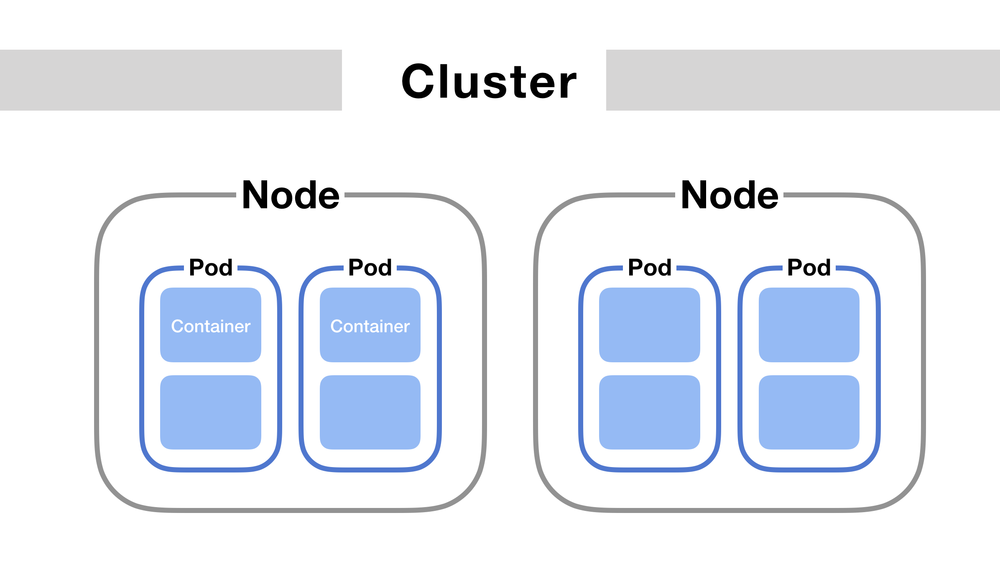

Networking
============

https://kubernetes.io/docs/concepts/cluster-administration/networking/

https://matthewpalmer.net/kubernetes-app-developer/articles/kubernetes-networking-guide-beginners.html

- container-to-container communications
- Pod-to-Pod communications
- Pod-to-Service communications
- External-to-Service communications

Kubernetes Networking Model

- All pods can communicate with each other on all Nodes
- Agents on a Node can communicate with all pods on that Node
- No Network Address Translation(NAT)

Kubernetes Network Topology

- Node Network
- Pod Network
- Cluster Network (used by Services)

.. toctree::
   :maxdepth: 2
   :caption: Contents:

   network/pod-network
   network/cluster-dns
   network/service
   network/service-auto
   network/ingress
