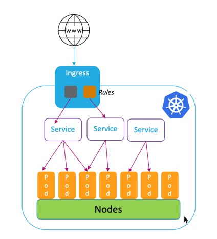
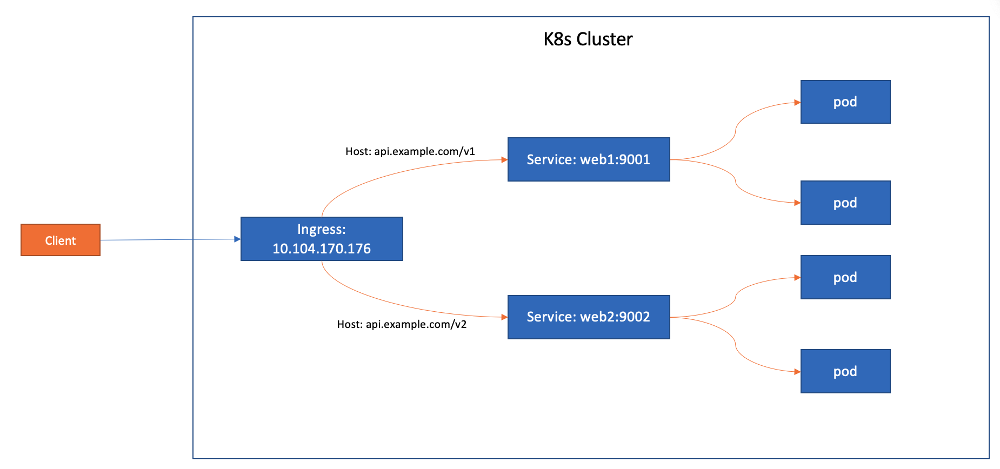

Ingress
=========

What is Ingress?
--------------------

参考 https://kubernetes.io/docs/concepts/services-networking/ingress/

.. image:: ../_static/network/ingress-overview.svg
   :alt: ingress-overview

简单说，就是接收请求，并根据一定的路由规则，把请求转发到相应的Service上去。

两个要求：

- Ingress Resource，就是一系列的路由规则 routing rules
- Ingress Controller, 控制实现这些路由规则。（https://kubernetes.io/docs/concepts/services-networking/ingress-controllers/）

Ingress Controller
---------------------

Nginx Ingress Controller: https://github.com/kubernetes/ingress-nginx/blob/main/docs/deploy/index.md

创建 Nginx ingress Controller

.. code-block:: bash

  $ kubectl apply -f https://raw.githubusercontent.com/kubernetes/ingress-nginx/controller-v1.2.1/deploy/static/provider/cloud/deploy.yaml

Type of Ingress
--------------------------

Exposing a Single Service with Ingress
~~~~~~~~~~~~~~~~~~~~~~~~~~~~~~~~~~~~~~~~~

Create a web server deployment and service

.. code-block:: bash

  $ kubectl create deployment demo --image=httpd --port=80
  $ kubectl expose deployment demo

Create ingress resource:

.. code-block:: yaml

    apiVersion: networking.k8s.io/v1
    kind: Ingress
    metadata:
      name: demo-localhost
      namespace: default
    spec:
      ingressClassName: nginx
      rules:
      - host: demo.localdev.me
        http:
          paths:
          - backend:
              service:
                name: demo
                port:
                  number: 80
            path: /
            pathType: Prefix

找到demo这个service的cluster IP(10.100.162.241)，以及 ingress-nginx-controller这个service的ClusterIP(10.101.55.153，

.. code-block:: bash

  kubectl get svc -A
  NAMESPACE       NAME                                 TYPE           CLUSTER-IP       EXTERNAL-IP   PORT(S)                      AGE
  default         demo                                 ClusterIP      10.100.162.241   <none>        80/TCP                       19m
  default         kubernetes                           ClusterIP      10.96.0.1        <none>        443/TCP                      37d
  ingress-nginx   ingress-nginx-controller             LoadBalancer   10.101.55.153    <pending>     80:32765/TCP,443:32009/TCP   16m
  ingress-nginx   ingress-nginx-controller-admission   ClusterIP      10.110.135.56    <none>        443/TCP                      16m
  kube-system     kube-dns                             ClusterIP      10.96.0.10       <none>        53/UDP,53/TCP,9153/TCP       37d

- 直接访问demo的clusterIP是可以的

.. code-block:: bash

  $ curl 10.100.162.241
  <html><body><h1>It works!</h1></body></html>

- 但是直接访问ingress-nginx-controller的ClusterIP是不可以的

.. code-block:: bash

  $ curl 10.101.55.153
  <html>
  <head><title>404 Not Found</title></head>
  <body>
  
<h1>404 Not Found</h1>

  

nginx

  </body>
  </html>

需要通过域名访问, 当然前提是要把域名对应的ingress-nginx-controller的ClusterIP放到系统hosts文件里。

.. code-block:: bash

  $ curl demo.localdev.me
  <html><body><h1>It works!</h1></body></html>
  $ more /etc/hosts | grep demo
  10.101.55.153 demo.localdev.me

Exposing Multiple Services with Ingress (Simple fanout )
~~~~~~~~~~~~~~~~~~~~~~~~~~~~~~~~~~~~~~~~~~~~~~~~~~~~~~~~~~~

创建两个deployment，两个Service

.. code-block:: bash

  $ kubectl create deployment web1 --image=gcr.io/google-samples/hello-app:1.0 --port=8080 --replicas=2
  $ kubectl expose deployment web1 --port 9001 --target-port 8080
  $ kubectl create deployment web2 --image=gcr.io/google-samples/hello-app:2.0 --port=8080 --replicas=2
  $ kubectl expose deployment web2 --port 9002 --target-port 8080

  $ kubectl get deployments.apps
  NAME   READY   UP-TO-DATE   AVAILABLE   AGE
  web1   2/2     2            2           2m3s
  web2   2/2     2            2           111s
  $ kubectl get svc
  NAME         TYPE        CLUSTER-IP     EXTERNAL-IP   PORT(S)    AGE
  kubernetes   ClusterIP   10.96.0.1      <none>        443/TCP    39d
  web1         ClusterIP   10.99.37.121   <none>        9001/TCP   89s
  web2         ClusterIP   10.102.94.47   <none>        9002/TCP   81s

创建Ingress

.. code-block:: yaml

    apiVersion: networking.k8s.io/v1
    kind: Ingress
    metadata:
      name: ingress-multiple
    spec:
      ingressClassName: nginx
      rules:
        - host: api.example.com
          http:
            paths:
            - path: /v1
              pathType: Prefix
              backend:
                service:
                  name: web1
                  port:
                    number: 9001
            - path: /v2
              pathType: Prefix
              backend:
                service:
                  name: web2
                  port:
                    number: 9002
      defaultBackend:
        service:
          name: web1
          port:
            number: 9001

.. code-block:: bash

  $ kubectl get ingress
  NAME               CLASS   HOSTS             ADDRESS   PORTS   AGE
  ingress-multiple   nginx   api.example.com             80      23m
  $ kubectl describe ingress ingress-multiple
  Name:             ingress-multiple
  Labels:           <none>
  Namespace:        default
  Address:
  Ingress Class:    nginx
  Default backend:  web1:9001 (10.244.1.212:8080,10.244.2.204:8080)
  Rules:
    Host             Path  Backends
    ----             ----  --------
    api.example.com
                    /v1   web1:9001 (10.244.1.212:8080,10.244.2.204:8080)
                    /v2   web2:9002 (10.244.1.213:8080,10.244.2.205:8080)
  Annotations:       <none>
  Events:
    Type    Reason  Age   From                      Message
    ----    ------  ----  ----                      -------
    Normal  Sync    23m   nginx-ingress-controller  Scheduled for sync

设置hosts文件

.. code-block:: bash

  $ more /etc/hosts

  10.104.170.176 api.example.com

访问

.. code-block:: bash

  $ curl api.example.com
  Hello, world!
  Version: 1.0.0
  Hostname: web1-7f6c665f7d-nmg8d
  $ curl api.example.com/v1
  Hello, world!
  Version: 1.0.0
  Hostname: web1-7f6c665f7d-472c2
  $ curl api.example.com/v2
  Hello, world!
  Version: 2.0.0
  Hostname: web2-8c85c8cd8-xw6f7
  $

Name Based Virtual Hosts with Ingress
~~~~~~~~~~~~~~~~~~~~~~~~~~~~~~~~~~~~~~~~

.. image:: ../_static/network/ingress-virtual-host.png
   :alt: ingress-k8s-vh

.. code-block:: yaml

    apiVersion: networking.k8s.io/v1
    kind: Ingress
    metadata:
      name: ingress-multiple
    spec:
      ingressClassName: nginx
      rules:
        - host: v1.api.example.com
          http:
            paths:
            - path: /
              pathType: Prefix
              backend:
                service:
                  name: web1
                  port:
                    number: 9001
        - host: v2.api.example.com
          http:
            paths:
            - path: /
              pathType: Prefix
              backend:
                service:
                  name: web2
                  port:
                    number: 9002

Using TLS certificates for HTTPs Ingress
~~~~~~~~~~~~~~~~~~~~~~~~~~~~~~~~~~~~~~~~~~~

生成key

.. code-block:: bash

  $ openssl req -x509 -nodes -days 365 -newkey rsa:2048 -keyout tls.key -out tls.crt -subj "/CN=api.example.com"
  Generating a RSA private key
  ...........+++++
  ................................+++++
  writing new private key to 'tls.key'
  -----
  $ ls
  tls.crt  tls.key

Create secret:

.. code-block:: bash

  $ kubectl create secret tls test-tls --key="tls.key" --cert="tls.crt"
  secret/test-tls created
  $ kubectl get secrets
  NAME       TYPE                DATA   AGE
  test-tls   kubernetes.io/tls   2      6s

ingress-virtual-host.png

.. code-block:: yaml

    apiVersion: networking.k8s.io/v1
    kind: Ingress
    metadata:
      name: ingress-https
    spec:
      ingressClassName: nginx
      tls:
      - hosts:
          - api.example.com
        secretName: test-tls
      rules:
      - host: api.example.com
        http:
          paths:
          - path: /
            pathType: Prefix
            backend:
              service:
                name: web1
                port:
                  number: 9001

创建ingress。

修改hosts文件并测试

.. code-block::  bash

  $ sudo more /etc/hosts | grep api
  10.104.170.176 api.example.com
  $ curl https://api.example.com --insecure
  Hello, world!
  Version: 1.0.0
  Hostname: web1-7f6c665f7d-472c2
