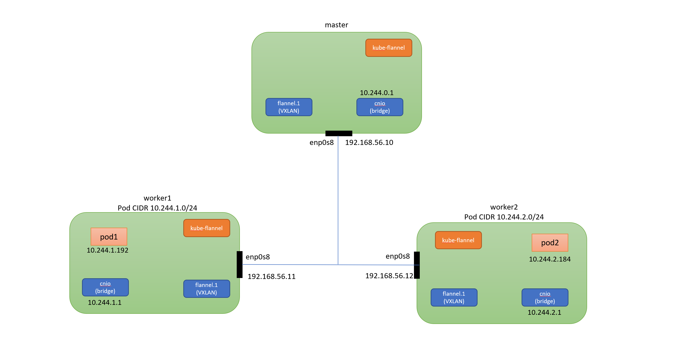

Pod Networking
==================

Basic
---------

- Pod share a network namespace
- Containers in a Pod communicate over localhost

这一节需要安装的一些包(以Ubuntu为例)

- ``bridge-utils``
- ``net-tools``

在集群的所有节点上安装

.. code-block:: bash

    $ sudo apt install bridge-utils net-tools

Container to Container in Pod
--------------------------------

创建测试Pod

.. code-block:: bash

  kubectl apply -f https://raw.githubusercontent.com/xiaopeng163/learn-k8s-from-scratch/master/source/_code/network/container-to-container.yml

.. literalinclude:: ../_code/network/container-to-container.yml
   :language: yaml
   :linenos:

获取到pod所在节点和pod的IP

.. code-block:: bash

  kubectl get pods -o wide
  NAME     READY   STATUS    RESTARTS   AGE   IP           NODE          NOMINATED NODE   READINESS GATES
  my-pod   2/2     Running   0          9s    10.244.1.4   k8s-worker1   <none>           <none>

这个pod的两个container共享一个network namespace，所以他们可以通过localhost进行通信，ip地址是10.244.1.4

可以在k8s-worker1节点上通过以下命令查看验证

.. code-block:: bash

  # get the container id
  $ sudo ctr --namespace=k8s.io container ls | grep net-box
  4bcad54d44ec02d7a55cc997e435217dff7c6e3ffa7e65b8940817da50d61b33    docker.io/xiaopeng163/net-box:latest                    io.containerd.runc.v2
  c1c0044f5f11ee4418240ec3a8e4e3d0e8a50257b4d4ab050dcd04b32f91ecd4    docker.io/xiaopeng163/net-box:latest                    io.containerd.runc.v2

  # get the network namespace for each container
  $ sudo ctr --namespace=k8s.io container info 4bcad54d44ec02d7a55cc997e435217dff7c6e3ffa7e65b8940817da50d61b33 | jq '.Spec.linux.namespaces'
  [
    {
      "type": "pid"
    },
    {
      "type": "ipc",
      "path": "/proc/14188/ns/ipc"
    },
    {
      "type": "uts",
      "path": "/proc/14188/ns/uts"
    },
    {
      "type": "mount"
    },
    {
      "type": "network",
      "path": "/proc/14188/ns/net"
    },
    {
      "type": "cgroup"
    }
  ]
  $ sudo ctr --namespace=k8s.io container info c1c0044f5f11ee4418240ec3a8e4e3d0e8a50257b4d4ab050dcd04b32f91ecd4 | jq '.Spec.linux.namespaces'
  [
    {
      "type": "pid"
    },
    {
      "type": "ipc",
      "path": "/proc/14188/ns/ipc"
    },
    {
      "type": "uts",
      "path": "/proc/14188/ns/uts"
    },
    {
      "type": "mount"
    },
    {
      "type": "network",
      "path": "/proc/14188/ns/net"
    },
    {
      "type": "cgroup"
    }
  ]

  # check the ipaddress for the network namespace
  $ sudo nsenter -t 14188 -n ip addr
  1: lo: <LOOPBACK,UP,LOWER_UP> mtu 65536 qdisc noqueue state UNKNOWN group default qlen 1000
      link/loopback 00:00:00:00:00:00 brd 00:00:00:00:00:00
      inet 127.0.0.1/8 scope host lo
        valid_lft forever preferred_lft forever
      inet6 ::1/128 scope host
        valid_lft forever preferred_lft forever
  2: eth0@if5: <BROADCAST,MULTICAST,UP,LOWER_UP> mtu 1450 qdisc noqueue state UP group default
      link/ether b6:87:92:e4:40:43 brd ff:ff:ff:ff:ff:ff link-netnsid 0
      inet 10.244.1.4/24 brd 10.244.1.255 scope global eth0
        valid_lft forever preferred_lft forever
      inet6 fe80::b487:92ff:fee4:4043/64 scope link
        valid_lft forever preferred_lft forever

Pod to Pod (single node)
-----------------------------

.. code-block:: yaml

    apiVersion: v1
    kind: Pod
    metadata:
      name: mypod1
    spec:
      nodeName: 'k8s-worker1'
      containers:
      - name: pod1
        image: xiaopeng163/net-box
        command: ["sh", "-c", "while true; do echo $(date) >> /tmp/index.html; sleep 60; done"]
    ---
    apiVersion: v1
    kind: Pod
    metadata:
      name: mypod2
    spec:
      nodeName: 'k8s-worker1'
      containers:
      - name: pod2
        image: xiaopeng163/net-box
        command: ["sh", "-c", "while true; do echo $(date) >> /tmp/index.html; sleep 60; done"]

Pod to Pod (multi-Node)
-----------------------------

.. code-block:: yaml

    apiVersion: v1
    kind: Pod
    metadata:
      name: mypod1
    spec:
      containers:
      - name: pod1
        image: xiaopeng163/net-box
        command: ["sh", "-c", "while true; do echo $(date) >> /tmp/index.html; sleep 60; done"]
    ---
    apiVersion: v1
    kind: Pod
    metadata:
      name: mypod2
    spec:
      containers:
      - name: pod2
        image: xiaopeng163/net-box
        command: ["sh", "-c", "while true; do echo $(date) >> /tmp/index.html; sleep 60; done"]

References
-------------------

https://kubernetes.io/docs/concepts/cluster-administration/networking/

https://medium.com/@anilkreddyr/kubernetes-with-flannel-understanding-the-networking-part-2-78b53e5364c7
