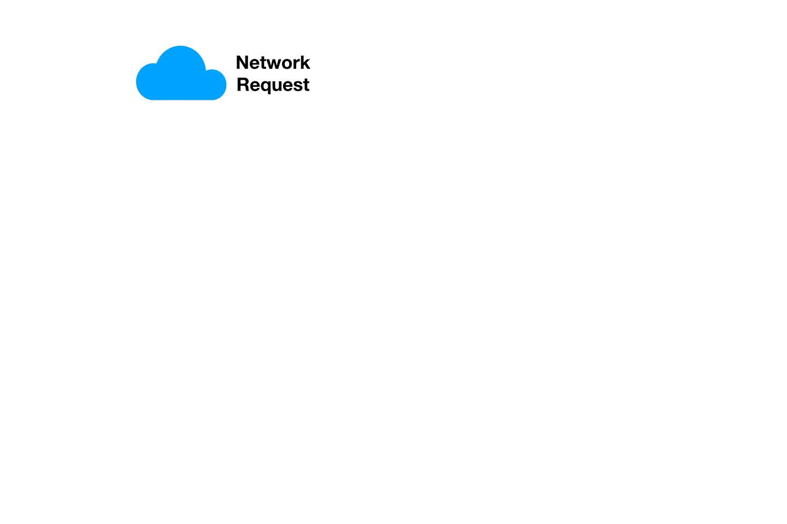

Services
=========

https://kubernetes.io/docs/concepts/services-networking/service/

- Persistent endpoint access for clients
- Adds persistency to the ephemerality of Pods
- Networking abstration providing persistent virutal IP and DNS
- Load balances to the backend Pods
- Automatically updated during pod controller operations

How Services Work
---------------------

Services match pods using Labels and Selectors

Creates and registers Endpoints in the Service (Pod IP and port pair)

Implemented in the kube-proxy on the Node in iptables

Kube-proxy watches the API Server and Endpoints

Lab
-----

创建一个Deployment

.. code-block:: yaml

    apiVersion: apps/v1
    kind: Deployment
    metadata:
      name: hello-world
    spec:
      replicas: 1
      selector:
        matchLabels:
          app: hello-world
      template:
        metadata:
          labels:
            app: hello-world
        spec:
          containers:
          - name: hello-world
            image: gcr.io/google-samples/hello-app:1.0
            ports:
            - containerPort: 8080

Service Types
---------------

ClusterIP(Default)
~~~~~~~~~~~~~~~~~~~~~~

when application deson't need to be accessed by the outside of the cluster, 会分配到一个内部的cluster IP。

.. code-block:: bash

    $ kubectl expose deployment hello-world --port=80 --target-port=8080
    $ kubectl get svc
    NAME          TYPE        CLUSTER-IP       EXTERNAL-IP   PORT(S)   AGE
    hello-world   ClusterIP   10.107.138.203   <none>        80/TCP    119s
    kubernetes    ClusterIP   10.96.0.1        <none>        443/TCP   36d
    $ curl 10.107.138.203
    Hello, world!
    Version: 1.0.0
    Hostname: hello-world-55594b4d48-nmtvd
    $ curl 10.107.138.203
    Hello, world!
    Version: 1.0.0
    Hostname: hello-world-55594b4d48-st7fx

yaml format

.. code-block:: bash

    $ kubectl get svc hello-world -o yaml

How it works (deep dive)

.. code-block::  bash

    $ sudo iptables -t nat -L KUBE-SERVICES -n  | column -t
    Chain                      KUBE-SERVICES  (2   references)
    target                     prot           opt  source       destination
    KUBE-SVC-JD5MR3NA4I4DYORP  tcp            --   0.0.0.0/0    10.96.0.10      /*  kube-system/kube-dns:metrics  cluster  IP          */     tcp   dpt:9153
    KUBE-SVC-NPX46M4PTMTKRN6Y  tcp            --   0.0.0.0/0    10.96.0.1       /*  default/kubernetes:https      cluster  IP          */     tcp   dpt:443
    KUBE-SVC-DZ6LTOHRG6HQWHYE  tcp            --   0.0.0.0/0    10.107.138.203  /*  default/hello-world           cluster  IP          */     tcp   dpt:80
    KUBE-SVC-TCOU7JCQXEZGVUNU  udp            --   0.0.0.0/0    10.96.0.10      /*  kube-system/kube-dns:dns      cluster  IP          */     udp   dpt:53
    KUBE-SVC-ERIFXISQEP7F7OF4  tcp            --   0.0.0.0/0    10.96.0.10      /*  kube-system/kube-dns:dns-tcp  cluster  IP          */     tcp   dpt:53
    KUBE-NODEPORTS             all            --   0.0.0.0/0    0.0.0.0/0       /*  kubernetes                    service  nodeports;  NOTE:  this  must      be  the  last  rule  in  this  chain  */  ADDRTYPE  match  dst-type  LOCAL

    $ sudo iptables -t nat -L KUBE-SVC-DZ6LTOHRG6HQWHYE  -n | column -t
    Chain                      KUBE-SVC-DZ6LTOHRG6HQWHYE  (1   references)
    target                     prot                       opt  source          destination
    KUBE-MARK-MASQ             tcp                        --   !10.244.0.0/16  10.107.138.203  /*  default/hello-world  cluster  IP                 */  tcp        dpt:80
    KUBE-SEP-W2IFVPZJILTBGJON  all                        --   0.0.0.0/0       0.0.0.0/0       /*  default/hello-world  ->       10.244.1.199:8080  */  statistic  mode    random  probability  0.50000000000
    KUBE-SEP-QWI4LEXVO5GRYADO  all                        --   0.0.0.0/0       0.0.0.0/0       /*  default/hello-world  ->       10.244.2.190:8080  */

cleanup and delete the service

NodePort
~~~~~~~~~~~

This makes the service accessible on a static port on each Node in the cluster.

.. code-block:: bash

    $ kubectl expose deployment hello-world  --target-port=8080 --type=NodePort
    service/hello-world exposed
    $ kubectl get svc
    NAME          TYPE        CLUSTER-IP      EXTERNAL-IP   PORT(S)          AGE
    hello-world   NodePort    10.111.34.177   <none>        8080:30583/TCP   5s
    kubernetes    ClusterIP   10.96.0.1       <none>        443/TCP          36d

    $ curl 127.0.0.1:30583
    Hello, world!
    Version: 1.0.0
    Hostname: hello-world-7c649d8c6f-pqbdt

iptables rules

.. code-block:: bash

    $ sudo iptables -t nat -L PREROUTING | column -t
    Chain          PREROUTING  (policy  ACCEPT)
    target         prot        opt      source    destination
    KUBE-SERVICES  all         --       anywhere  anywhere     /*  kubernetes  service  portals  */
    $ sudo iptables -t nat -L KUBE-SERVICES  -n  | column -t
    Chain                      KUBE-SERVICES  (2   references)
    target                     prot           opt  source       destination
    KUBE-SVC-NPX46M4PTMTKRN6Y  tcp            --   0.0.0.0/0    10.96.0.1      /*  default/kubernetes:https      cluster  IP          */     tcp   dpt:443
    KUBE-SVC-DZ6LTOHRG6HQWHYE  tcp            --   0.0.0.0/0    10.111.34.177  /*  default/hello-world           cluster  IP          */     tcp   dpt:8080
    KUBE-SVC-TCOU7JCQXEZGVUNU  udp            --   0.0.0.0/0    10.96.0.10     /*  kube-system/kube-dns:dns      cluster  IP          */     udp   dpt:53
    KUBE-SVC-ERIFXISQEP7F7OF4  tcp            --   0.0.0.0/0    10.96.0.10     /*  kube-system/kube-dns:dns-tcp  cluster  IP          */     tcp   dpt:53
    KUBE-SVC-JD5MR3NA4I4DYORP  tcp            --   0.0.0.0/0    10.96.0.10     /*  kube-system/kube-dns:metrics  cluster  IP          */     tcp   dpt:9153
    KUBE-NODEPORTS             all            --   0.0.0.0/0    0.0.0.0/0      /*  kubernetes                    service  nodeports;  NOTE:  this  must      be  the  last  rule  in  this  chain  */  ADDRTYPE  match  dst-type  LOCAL
    $ sudo iptables -t nat -L KUBE-NODEPORTS  -n  | column -t
    Chain                      KUBE-NODEPORTS  (1   references)
    target                     prot            opt  source       destination
    KUBE-EXT-DZ6LTOHRG6HQWHYE  tcp             --   0.0.0.0/0    0.0.0.0/0    /*  default/hello-world  */  tcp  dpt:30583
    $ sudo iptables -t nat -L KUBE-EXT-DZ6LTOHRG6HQWHYE  -n  | column -t
    Chain                      KUBE-EXT-DZ6LTOHRG6HQWHYE  (1   references)
    target                     prot                       opt  source       destination
    KUBE-MARK-MASQ             all                        --   0.0.0.0/0    0.0.0.0/0    /*  masquerade  traffic  for  default/hello-world  external  destinations  */
    KUBE-SVC-DZ6LTOHRG6HQWHYE  all                        --   0.0.0.0/0    0.0.0.0/0
    $ sudo iptables -t nat -L KUBE-SVC-DZ6LTOHRG6HQWHYE  -n  | column -t
    Chain                      KUBE-SVC-DZ6LTOHRG6HQWHYE  (2   references)
    target                     prot                       opt  source          destination
    KUBE-MARK-MASQ             tcp                        --   !10.244.0.0/16  10.111.34.177  /*  default/hello-world  cluster  IP                 */  tcp        dpt:8080
    KUBE-SEP-KNPMKP4TJWLYHY4M  all                        --   0.0.0.0/0       0.0.0.0/0      /*  default/hello-world  ->       10.244.1.200:8080  */  statistic  mode      random  probability  0.50000000000
    KUBE-SEP-ZYVBQARSCNBBR4HH  all                        --   0.0.0.0/0       0.0.0.0/0      /*  default/hello-world  ->       10.244.2.192:8080  */
    $

LoadBalancer
~~~~~~~~~~~~~

The service becomes accessible externally through a cloud provider's load balancer functionality. GCP, AWS, Azure, and OpenStack offer this functionality.

Azure kubernetes cluster

.. code-block:: bash

  $ kubectl get nodes -o wide
  NAME                                 STATUS   ROLES   AGE     VERSION   INTERNAL-IP   EXTERNAL-IP   OS-IMAGE             KERNEL-VERSION     CONTAINER-RUNTIME
  aks-services-38564575-vmss000003     Ready    agent   4m56s   v1.21.9   10.224.0.4    <none>        Ubuntu 18.04.6 LTS   5.4.0-1083-azure   containerd://1.4.13+azure-3
  aks-workspaces-33629094-vmss000003   Ready    agent   5m10s   v1.21.9   10.224.0.5    <none>        Ubuntu 18.04.6 LTS   5.4.0-1083-azure   containerd://1.4.13+azure-3

create Deoployment

.. code-block:: yaml

    apiVersion: apps/v1
    kind: Deployment
    metadata:
      name: hello-world
    spec:
      replicas: 1
      selector:
        matchLabels:
          app: hello-world
      template:
        metadata:
          labels:
            app: hello-world
        spec:
          containers:
          - name: hello-world
            image: gcr.io/google-samples/hello-app:1.0
            ports:
            - containerPort: 8080

.. code-block:: bash

  $ kubectl get deployments.apps
  NAME          READY   UP-TO-DATE   AVAILABLE   AGE
  hello-world   2/2     2            2           5m50s
  $ kubectl get pods -o wide
  NAME                           READY   STATUS    RESTARTS   AGE    IP           NODE                               NOMINATED NODE   READINESS GATES
  hello-world-54575d5b77-cp75f   1/1     Running   0          6m4s   10.244.1.5   aks-services-38564575-vmss000003   <none>           <none>
  hello-world-54575d5b77-g24fm   1/1     Running   0          6m4s   10.244.1.6   aks-services-38564575-vmss000003   <none>           <none>
  $

create Service

.. code-block:: bash

  $ kubectl expose deployment hello-world --port=80 --target-port=8080 --type=LoadBalancer
  service/hello-world exposed
  $ kubectl get service
  NAME          TYPE           CLUSTER-IP     EXTERNAL-IP    PORT(S)        AGE
  hello-world   LoadBalancer   10.0.202.198   23.97.235.50   80:31468/TCP   29s

打开浏览器访问 http://23.97.235.50/

